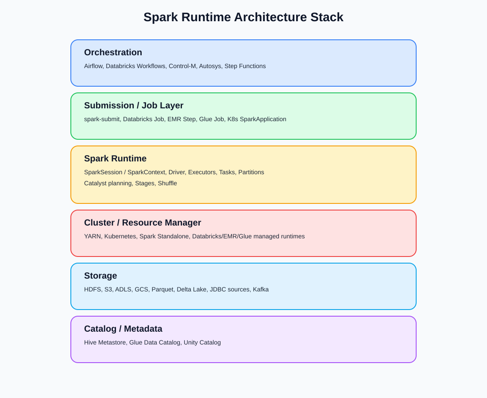
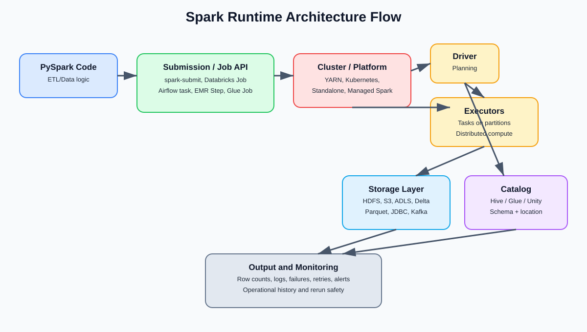
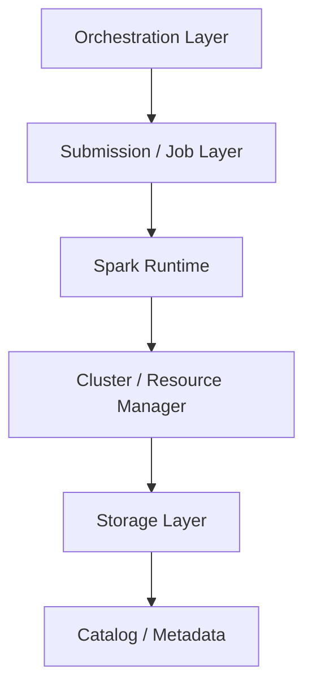
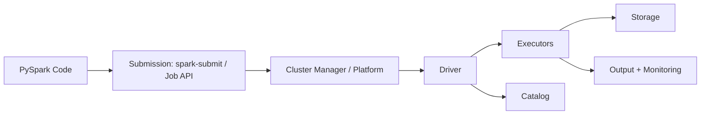

# Spark Runtime Architecture Diagram Notes

These diagrams are conceptual architecture aids for Course 11 review.
They are not exact vendor-specific network topology diagrams.

## 1) Stack Diagram

File:
assets/spark_runtime_architecture_stack.svg

Purpose:
Show the architecture stack in layers:
- Orchestration
- Submission / Job Layer
- Spark Runtime
- Cluster / Resource Manager
- Storage
- Catalog / Metadata

## 2) Flow Diagram

File:
assets/spark_runtime_architecture_flow.svg

Purpose:
Show runtime flow:
PySpark code
-> spark-submit / Databricks Job / Airflow / Glue / EMR
-> cluster manager / platform
-> driver
-> executors
-> storage/catalog
-> output and monitoring

## Mermaid-Style Source (Conceptual)

## Arrow Meanings

- `PySpark code -> submission`: business logic is packaged/started.
- `submission -> cluster/platform`: runtime target and resources are requested.
- `cluster/platform -> driver/executors`: compute processes are allocated.
- `executors -> storage`: data is read/written.
- `driver -> catalog`: table/schema metadata is resolved.
- `output + monitoring`: job result and operational signals are produced.
