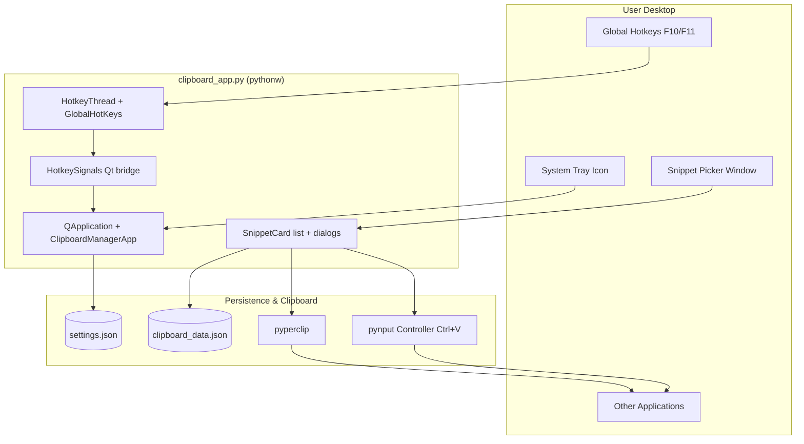

# GROK Architecture — Universal Clipboard Manager

**Last updated:** 2026-06-17

---

## System Diagram



---

## Threading Model

| Component | Thread |
|-----------|--------|
| Qt UI, tray, window | Main thread (`QApplication` event loop) |
| `HotkeyThread` | Background `QThread` running `pynput` listener |
| Signal bridge | `HotkeySignals` (`QObject`) — thread-safe Qt signals |

On shutdown: `aboutToQuit` → `hotkey_thread.stop()` → `wait()`

---

## Class Responsibilities

### `HotkeySignals`
- `toggle_visibility` → show/hide main window
- `add_from_clipboard` → capture current clipboard text

### `HotkeyThread`
- Builds hotkey map from settings lists
- Multiple keys can map to same action
- Runs until app exit

### `SnippetCard`
- One row: read-only text + Copy / Edit / Delete
- Delegates to `ClipboardManagerApp`

### `SnippetDialog`
- Modal add/edit with `QTextEdit`

### `ClipboardManagerApp`
- Orchestrates: data load, UI, tray, hotkeys
- Starts **hidden**; tray is primary entry
- `toggle_visibility`, `paste_snippet`, `add_from_clipboard`, CRUD

---

## Startup Sequence

```
time.sleep(1)                    # Desktop readiness
QApplication(sys.argv)
app.setQuitOnLastWindowClosed(False)
ClipboardManagerApp()
  ensure_settings_file()
  load_settings()
  load_clipboard_data()
  setup_system_tray()
  HotkeyThread.start()
  self.hide()
app.exec()
```

Windows Startup path: `UniversalClipboardManager.lnk` → `launch_clipboard.bat` (minimized)

---

## Configuration Flow

```
settings.json ──► load_settings() ──► normalize hotkeys
                         │
                         ▼ (missing/invalid)
              DEFAULT_SHOW_WINDOW_HOTKEYS
              DEFAULT_CAPTURE_CLIPBOARD_HOTKEYS
```

pynput format examples: `<f10>`, `<ctrl>+<alt>+s`

---

## Deployment Architecture

```
Source Repo (D:\Workarea\StudyBook\...\UniversalClipboardManager)
        │
        │ deploy.ps1 / setp_project.ps1
        ▼
Runtime Install (C:\scripts\UniversalClipboardManager)
        │
        ├── .venv\Scripts\pythonw.exe
        ├── clipboard_app.py
        ├── clipboard_data.json
        ├── settings.json
        └── launch_clipboard.bat
                │
                ▼
        Windows Startup .lnk (auto-launch on login)
```

---

## Extension Points (Future Work)

| Area | Current | Possible enhancement |
|------|---------|---------------------|
| Single instance | None | Mutex / lock file / named pipe |
| Tray icon | Qt standard pixmap | Custom `.ico` resource |
| Settings | Hotkeys only | UI settings panel, theme |
| Capture | On-demand hotkey | Optional passive monitor (large scope) |
| Data | Flat JSON array | Categories, search, encryption |
| Setup parity | `setp_project.ps1` gap | Add `settings.json` to copy list |

---

## Dependencies Graph

```
clipboard_app.py
├── PyQt6 (UI, tray, signals, threading)
├── pynput (GlobalHotKeys, Controller)
├── pyperclip (clipboard read/write)
└── stdlib: sys, os, json, time
```