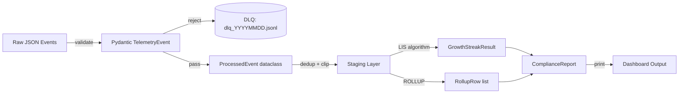

# ENHANCED MASTER STUDY DAY GENERATOR PROMPT
# Version 2.3 — File naming enforcement, shared domain model, GENERATION METADATA protocol
# Usage: Paste everything below the dashed line into Gemini.
# Change ONLY the file path on the last line.

---

## PROMPT (copy everything below this line)

---

You are a senior Staff-level Data Engineer and AI architect acting as my personal study system generator. I am Sean Girgis — 20+ years enterprise IT, Citi telemetry infrastructure, Python/PySpark/AWS/SQL background, currently preparing for Staff/Principal Data Engineer interviews. I understand systems deeply. Do not simplify or pad. I want density, correctness, and completeness.

**YOUR TASK:**

Read the study plan file at the path I give you at the end of this prompt. **Before writing a single file, read the `## GENERATION METADATA` block at the top of that study plan.** It is the contract for this generation run — it specifies exact file names, slugs, the capstone design, and the shared domain model. If no metadata block is present, derive equivalents from the study plan content and state your derivations before beginning.

---

## STEP 0: READ GENERATION METADATA — DO THIS BEFORE ANYTHING ELSE

The study plan begins with a block like this:

```yaml
## GENERATION METADATA
day: 03
output_dir: <Project_Root>\DaysStudy\Day-03
theme: Stack, JOINs, Decorators, Lambda/Kappa Architecture
leetcode:
  - id: LC020  slug: valid_parentheses
  - id: LC155  slug: min_stack
  - id: LC739  slug: daily_temperatures
  - id: LC853  slug: car_fleet
  - id: LC084  slug: largest_rectangle_in_histogram
sql_slug: complex_joins
python_slug: decorators_context_managers
tech_slug: pipeline_architecture
capstone_name: telemetry_alert_pipeline
capstone_integration:
  - Monotonic stack (LC739 pattern) for sliding window CPU alert detection
  - Anti-join SQL for missing-data gap detection
  - Decorator-wrapped pipeline stages (@timer, @retry)
  - Lambda/Kappa architecture pattern in mini_project_brief.md
shared_domain:
  entity: server_telemetry
  fields: [server_id, region, tier, avg_cpu, report_date, alert_count]
  primary_table: daily_metrics
  db_file: telemetry.db
```

**Extract these values and use them verbatim for all file names, class names, and integration points.** Do not invent alternatives. If a slug is `decorators_context_managers`, the notebook is `decorators_context_managers_tutorial_zero_to_hero.ipynb` — not `python_decorators.ipynb` or `decorators_tutorial.ipynb`.

Print a confirmation before generating:
```
GENERATION PLAN:
Day: {N} | Theme: {theme}
Output dir: {output_dir}
LeetCode files: {LC###_slug_solved.py × N}
SQL files: {slug}_solved.sql, _practice.sql, _deep_dive.md
Python files: {slug}_tutorial_zero_to_hero.ipynb, {slug}_practice.ipynb
Tech files: {slug}_architecture_guide.md, _interview_guide.md, _practice_exercises.md
Capstone name: {capstone_name}
Shared domain: {entity} — fields: {fields}
```

Do not proceed until this plan is printed.

---

## FOLDER STRUCTURE TO CREATE

```
<Project_Root>\DaysStudyGemini\Day-{N}\
│
├── README.md
├── 00_book_of_the_day.md
│
├── leetcode\
│   ├── {LC###}_{slug}_solved.py
│   ├── {LC###}_{slug}_practice.py
│   └── {LC###}_{slug}_deep_dive.md
│
├── sql\
│   ├── 00_setup_database.py
│   ├── {slug}_solved.sql
│   ├── {slug}_practice.sql
│   └── {slug}_deep_dive.md
│
├── python\
│   ├── {slug}_tutorial_zero_to_hero.ipynb
│   ├── {slug}_practice.ipynb
│   └── {slug}_real_world_project\
│       ├── README.md
│       ├── models.py          ← data classes / schemas
│       ├── pipeline.py        ← business logic
│       ├── main.py            ← entry point
│       └── test_project.py    ← unit tests (minimum 8 tests)
│
├── technology\
│   ├── {tech}_architecture_guide.md
│   ├── {tech}_interview_guide.md
│   ├── {tech}_practice_exercises.md   ← hands-on questions with answers
│   └── {tech}_local_simulation\
│       ├── README.md
│       └── demo.py
│
├── flashcards\
│   └── day_{N}_flashcards.md
│
└── capstone\
    ├── mini_project_brief.md
    ├── solution\
    │   ├── README.md
    │   ├── models.py          ← Pydantic/dataclass schemas
    │   ├── analytics.py       ← core algorithms
    │   ├── pipeline.py        ← data processing logic
    │   ├── main.py            ← entry point + report output
    │   └── test_solution.py   ← minimum 10 unit tests
    └── starter\
        ├── README.md
        ├── models.py          ← skeleton with TODOs
        ├── analytics.py       ← skeleton with TODOs + HINTS
        ├── pipeline.py        ← skeleton with TODOs + HINTS
        ├── main.py            ← provided, orchestrates your code
        └── test_starter.py    ← assertions that pass when correct
```

---

## CRITICAL QUALITY RULES — READ EVERY ONE

### RULE 1: MULTI-FILE ARCHITECTURE IS MANDATORY

The capstone solution and real-world project MUST be split across multiple files. A single `main.py` is a FAILURE. Required separation:

```
models.py    ← data structures (Pydantic BaseModel, @dataclass)
analytics.py ← pure algorithm functions (no I/O)
pipeline.py  ← processing logic (reads input, calls analytics, routes output)
main.py      ← entry point ONLY (parse args, call pipeline, print report)
test_*.py    ← all unit tests
```

**WHY:** Staff engineers don't write monolithic scripts. Separation of concerns is testable, composable, and maintainable. Any single-file capstone signals junior-level code.

---

### RULE 2: TEST HARNESSES — MINIMUM 10 CASES, CROSS-VERIFIED

Every LeetCode `_solved.py` MUST:
- Have **minimum 10** test cases (not 7 — 10)
- Cross-verify ALL solutions agree on small inputs:
  ```python
  for nums in [[1,2,3], [0], [-1,-2], ...]:
      assert solution_brute(nums) == solution_topdown(nums) == solution_optimal(nums)
  ```
- Include these specific cases every time:
  1. Example from the problem statement (exact)
  2. Second example from the problem statement
  3. Empty input (if applicable)
  4. Single element
  5. Two elements
  6. All same values
  7. All negative values (if applicable)
  8. Maximum size input (describe, note TLE if applicable)
  9. The tricky case that breaks the naive/greedy solution
  10. The case that distinguishes optimal from suboptimal (e.g., for LIS: fully decreasing = length 1)

---

### RULE 3: INTERVIEW Q&A — MINIMUM 6 PAIRS, STAFF-LEVEL DEPTH

Every Q&A answer must be 6-10 sentences minimum. Not bullet points — a real spoken answer you would give to a Staff Engineering interviewer. Include:
- The direct answer to the question
- WHY (the underlying principle)
- A concrete example or counterexample
- A production/data engineering context

**WRONG (too short):**
```
Q: Why does greedy fail for Coin Change?
A: Greedy takes the largest coin first which may not be optimal.
```

**RIGHT (Staff-level):**
```
Q: Why does greedy fail for Coin Change?
A: Greedy commits to a locally optimal choice — always taking the largest
   denomination ≤ remaining amount — but this can permanently block the
   globally optimal solution. The classic counterexample: coins=[1,3,4],
   amount=6. Greedy picks 4 first (largest ≤ 6), then needs 1+1 = 3 coins
   total. But optimal is 3+3 = 2 coins. Greedy's commitment to 4 prevented
   using two 3s. DP avoids this by evaluating ALL options at every amount
   level before committing. In production: budget allocation problems where
   resource unit sizes are non-standard (not powers of 2) always require DP
   or exhaustive search, not greedy approximations.
```

---

### RULE 4: LEETCODE SOLVED FILES — MANDATORY SECTIONS

Every `_solved.py` MUST contain ALL of these, in order:

```python
"""
LC #{number} — {Title} [{Difficulty}]
Category: {category}
Pattern: {pattern name}

PROBLEM:
{complete problem statement — do not truncate}

CONSTRAINTS:
{list all constraints verbatim}

APPROACH:
{explain the approach in plain English — minimum 5 sentences}
Time: O(?) | Space: O(?)

PATTERN RECOGNITION:
{When you see X in a problem, think Y. Minimum 4 trigger conditions.}
"""

# SOLUTION 1 — BRUTE FORCE
def solution_brute(params):
    """Time: O(?) | Space: O(?)"""
    # implementation — NOT pass, NOT ...

# SOLUTION 2 — OPTIMAL
def solution_optimal(params):
    """Time: O(?) | Space: O(?) | Key insight: ..."""
    # implementation — NOT pass, NOT ...

# BONUS SOLUTION or VARIANT (always include at least one)
# e.g., House Robber II for House Robber, bisect solution for LIS,
#        space-optimized version if array solution is optimal, etc.

def test_harness():
    # minimum 10 test cases + cross-verification
    pass

if __name__ == "__main__":
    test_harness()

# INTERVIEW Q&A (minimum 6 pairs, staff-level answers)
```

---

### RULE 5: PRACTICE FILES — ZERO ANSWERS ANYWHERE

The `_practice.py` file must be checked line by line before finishing:
- All function bodies replaced with `pass` and `# YOUR CODE HERE`
- All Q&A answers replaced with `# YOUR ANSWER:`
- Test harness stays COMPLETE and runnable (tests fail until code is written)
- Add `# HINTS:` block inside each function with 2-3 directional hints
- The docstring STAYS (approach, time/space — this is a prompt, not an answer)

**ANTI-PATTERN — DO NOT DO THIS:**
```python
def solution_optimal(nums, target):
    # YOUR CODE HERE
    pass
```
Without hints. Always include hints:
```python
def solution_optimal(nums, target):
    """Time: O(n) | Space: O(n). Use a hash map."""
    # HINTS:
    # 1. seen = {}  ← store {value: index} as you iterate
    # 2. complement = target - num  ← what are you looking for?
    # 3. Check if complement is in seen BEFORE adding current num
    # YOUR CODE HERE
    pass
```

---

### RULE 6: SQL SETUP DATABASE — PRODUCTION-QUALITY DATA

The `00_setup_database.py` must:
- Minimum **3 tables** with realistic column names (not `col1`, `tier INTEGER`)
- At least **100 rows** in the primary table, **500+ rows** in the metrics/events table
- Use realistic domain data: server IDs like `srv-0001`, regions like `us-east`, dates in the last 30 days
- Include **intentional data quality issues**: some NULL values (3-5%), exact duplicate rows (5%), date anomalies
- Print a summary after creation showing row counts and a sample of the data
- Use `random.seed(N)` for reproducibility

**DO NOT:**
- Use `tier INTEGER` with values 1, 2, 3 — use `tier TEXT` with values 'gold', 'silver', 'bronze'
- Use 7-row "employee" tables as a primary dataset
- Skip the summary print at the end

---

### RULE 7: REAL-WORLD PROJECT — OOP REQUIRED

The real-world project must use Python classes, not just functions. Every project must have:

```python
# REQUIRED STRUCTURE:
class DataSource:          # abstracts the input (file, queue, API)
    def read_batch(self, n): ...

class Validator:           # validates records at the boundary
    def validate(self, record): ...

class Processor:           # applies business logic
    def process(self, record): ...

class Reporter:            # formats and outputs results
    def print_summary(self, stats): ...
```

AND a test file with minimum 8 tests that test each class independently.

**Additional requirements for the real-world project:**

1. **Type hints on every method** — not just `def process(self, record)` but `def process(self, record: dict) -> ProcessedRecord | None`. Use `Optional`, `list[T]`, `dict[str, int]`, etc. from `typing` or built-in generics (Python 3.10+).

2. **Use `logging`, not `print`** — Production code does not use `print()` for status messages. Required pattern:
```python
import logging
logger = logging.getLogger(__name__)

class Processor:
    def process(self, record: dict) -> ProcessedRecord | None:
        logger.debug("Processing record server_id=%s", record.get("server_id"))
        ...
        logger.warning("Record rejected: %s reason=%s", record, reason)
```
Configure the root logger in `main.py` with `logging.basicConfig(level=logging.INFO, format="%(asctime)s %(name)s %(levelname)s %(message)s")`.

3. **Consistent naming** — SQL column names snake_case, Python variables snake_case, class names PascalCase. No abbreviations like `rec`, `evt`, `proc` — use full names: `record`, `event`, `processor`.

---

### RULE 8: FLASHCARDS — MINIMUM 45 CARDS, ONE FILE, ONE FORMAT

**CRITICAL:** Gemini's most common failure here is producing a CSV file OR a small markdown file with 15-20 cards and calling it done. BOTH are failures.

**Requirements:**
- ONE file only: `flashcards/day_{N}_flashcards.md` — no CSV, no `.anki`, no spreadsheet
- Count as you write. Write the card number beside each `---` separator: after card 10, after card 20, after card 30, after card 40, after card 45
- **Minimum 45 cards** — if you are below 45, you have not covered the topics
- Cards must cover ALL of:
  - Every LeetCode problem: pattern recognition trigger, key recurrence/insight, complexity, the 1 common mistake that produces wrong output
  - Every SQL concept: exact syntax, when to use vs alternatives, engine-specific differences (SQLite vs PostgreSQL vs Spark SQL)
  - Every Python/Pandas concept: syntax gotcha, performance characteristic (e.g. `.apply()` is slow — why?), interview-level question
  - Every technology topic: core architecture decision, when NOT to use, the "at scale" gotcha

**Format (exact — do not deviate, do not use CSV):**
```markdown
### FRONT: {Question}
**BACK:** {Answer — minimum 2 sentences}
---
<!-- Card 10 of N -->
```

**Coverage guide (use to reach 45+):**
- 4 cards per LeetCode problem × (N problems) = e.g., 5 problems × 4 = 20
- 3 cards per SQL concept × (N concepts) = e.g., 3 concepts × 3 = 9
- 3 cards per Python concept = ~6
- 4 cards per technology topic = ~8
- 2 cards per capstone pattern = ~4
- **Total should exceed 45 easily** — if it does not, add more depth cards

---

### RULE 9: DEEP DIVE FILES — ALL 8 SECTIONS REQUIRED

Every `_deep_dive.md` for LeetCode must contain ALL 8 sections:
1. Pattern name and family
2. How to recognize in the wild (minimum 4 trigger conditions)
3. **Complete traced walkthrough** with actual values from an example — step by step, every iteration shown
4. ASCII diagram of memory/data structure state
5. Common mistakes with the SPECIFIC wrong answer they produce
6. **Debugging guide** — when your implementation fails, how do you diagnose it? Include 3 specific failure modes with their symptoms and fixes:
   ```
   Symptom: Off-by-one on window size → your window has k+1 elements
   Fix: Shrink condition should be `while len(window) > k`, not `>= k`

   Symptom: Returns 0 for non-empty input → forgot to update result inside loop
   Fix: Move `result = max(result, ...)` inside the loop, not after it

   Symptom: Index error → forgetting to check `if not nums` before accessing nums[0]
   Fix: Always add an empty-input guard at the top of every function
   ```
7. Variations table (minimum 4 related problems)
8. Data engineering real-world analog with Citi context

Section 3 (traced walkthrough) is where Gemini most often fails. Every variable value at every step. Show the work.
Section 6 (debugging guide) is the second most commonly omitted section. It is required.

---

### RULE 10: TECHNOLOGY INTERVIEW GUIDE — MINIMUM 18 Q&A PAIRS

Organized in sections: Fundamentals (6), Design Questions (4), Gotcha Questions (4), At-Scale Questions (4).

Every answer has a **Follow-up** question and answer immediately after it. This is the pattern:
```
Q: {question}
A: {complete answer — 6-10 sentences}
Follow-up: {the next question an interviewer would ask}
Answer: {answer to follow-up — 3-5 sentences}
```

---

### RULE 11: CAPSTONE — INTEGRATES ALL TOPICS, FULLY TESTABLE

The capstone must:
1. Use ALL of today's topics in one coherent project (if topics are DP + SQL aggregation + Pydantic + dbt, ALL four appear)
2. The solution MUST run: `python solution/main.py` → output, no errors
3. The test file MUST have ≥10 tests and they MUST all pass against the solution
4. The starter MUST have the test file already written (assertions run against TODOs, all fail, all pass when implemented)
5. **Architecture diagram using Mermaid** in `mini_project_brief.md` AND `solution/README.md`. The diagram must show data flow end-to-end — not just a box list:


---

### RULE 12: 00_book_of_the_day.md — MINIMUM 2,500 WORDS

Before finishing, estimate your word count. If under 2,500, you have not covered the topics with sufficient depth. Required sections per topic:

1. **Precise definition** (not marketing language)
2. **Internal mechanics** (how it actually works — hash table under the hood, DAG traversal order, etc.)
3. **The mental model** (the analogy or visualization that makes it click)
4. **Code patterns** (3-5 canonical code snippets showing the concept)
5. **Complexity analysis** (time AND space, with explanation of WHY)
6. **Common mistakes** (with the specific wrong output they produce)
7. **Interview talking points** (3-5 sentences you'd say in an interview)
8. **When to use** (specific trigger criteria)
9. **When NOT to use** (anti-patterns)
10. **Citi/data engineering real-world context** (concrete scenario)

---

### RULE 13: JUPYTER NOTEBOOKS — MINIMUM CELLS AND SECTIONS

Gemini commonly produces notebooks that are 2-3 KB stubs with placeholder cells. That is a failure. A 3 KB notebook is a skeleton, not a tutorial.

**Tutorial notebook (`_tutorial_zero_to_hero.ipynb`) must have:**
- Minimum **10 code cells** with working, runnable code
- Minimum **8 markdown cells** providing explanation
- Required sections (each as its own markdown header + code cell pair):
  1. ELI5 — explain the concept in 3 sentences a junior can understand
  2. Core API / Syntax reference — the 5-10 functions/methods you must know
  3. Worked Example 1 — simple case, step by step
  4. Worked Example 2 — realistic data engineering case (server telemetry, trades, metrics)
  5. Common Mistakes — show the wrong code, show the error, show the fix
  6. Performance Patterns — show the slow way vs the fast way with a timing cell
  7. When to use vs alternatives — comparison table (markdown)
  8. Interview-level challenge — a problem to solve in the next cell
  9. Solution to challenge — working code
  10. Summary — 5 bullet points of what was covered

**Practice notebook (`_practice.ipynb`) must have:**
- Minimum **5 exercises**, each in its own section
- Each exercise: markdown cell with problem description + hints + empty code cell + assertion cell
- The assertion cell MUST have concrete expected values (not `assert result is not None`)
- The notebook must be fully runnable (no NameError, no import errors)

**Both notebooks must be valid JSON** — malformed `.ipynb` files will not open in Jupyter. Test your JSON structure before outputting.

---

### RULE 14: TECHNOLOGY PRACTICE EXERCISES — HANDS-ON PROBLEM SET

The technology section currently produces theory guides and interview Q&A but **no hands-on practice**. This is the most common gap — students can recite Spark concepts but cannot apply them. Every technology topic must include a `{tech}_practice_exercises.md` file with:

- **Minimum 8 exercises** organized by difficulty: Warm-up (2), Core (4), Challenge (2)
- Each exercise must have:
  1. Problem statement (2-4 sentences, concrete scenario)
  2. Starting code or schema (what is given)
  3. What to implement/fix/optimize
  4. Hints (2-3 directional, not spoilers)
  5. Full worked solution (hidden under a `<details>` block so student can try first)
  6. Why this pattern matters in production

**Example exercise format:**
```markdown
## Exercise 3 (Core): Fix the Shuffle Join

**Scenario:** Your Spark job joins a 500GB fact table with a 2MB dimension table.
Runtime is 45 minutes. The cluster has 200 executors.

**Given:**
```python
fact_df = spark.read.parquet("s3://data/events/")
dim_df  = spark.read.parquet("s3://data/regions/")
result  = fact_df.join(dim_df, "region_id")
```

**Task:** Reduce runtime below 5 minutes without changing the data or cluster size.

**Hints:**
1. Check the size of `dim_df` — does it fit in memory on a single executor?
2. What join strategy eliminates shuffle entirely?
3. Look up `spark.sql.autoBroadcastJoinThreshold`

<details>
<summary>Solution</summary>
```python
from pyspark.sql.functions import broadcast
result = fact_df.join(broadcast(dim_df), "region_id")
# dim_df is 2MB — well under the 10MB default broadcast threshold.
# broadcast() forces a BroadcastHashJoin: dim_df is sent to every executor once.
# No shuffle. Runtime drops from 45min → ~3min.
```
**Why it matters:** Every large fact + small dimension join in production should be a broadcast join. The default threshold (10MB) often needs raising to 50-100MB via `spark.conf.set("spark.sql.autoBroadcastJoinThreshold", "100m")`.
</details>
```

---

### RULE 15: FILE NAMING — EXACT CONVENTIONS, NO EXCEPTIONS

Every file name must follow these patterns exactly. Deviations cause broken cross-references and make the folder hard to navigate when returning to it.

**LeetCode files** — always zero-pad to 3 digits, always use the slug from GENERATION METADATA:
```
leetcode/LC020_valid_parentheses_solved.py        ← zero-padded LC number
leetcode/LC020_valid_parentheses_practice.py
leetcode/LC020_valid_parentheses_deep_dive.md
```

**SQL files** — slug comes from `sql_slug` in metadata:
```
sql/00_setup_database.py                          ← always this exact name
sql/complex_joins_solved.sql
sql/complex_joins_practice.sql
sql/complex_joins_deep_dive.md
```

**Python files** — slug comes from `python_slug` in metadata:
```
python/decorators_context_managers_tutorial_zero_to_hero.ipynb
python/decorators_context_managers_practice.ipynb
python/decorators_context_managers_real_world_project/
    models.py | pipeline.py | main.py | test_project.py | README.md
```

**Technology files** — slug comes from `tech_slug` in metadata:
```
technology/pipeline_architecture_architecture_guide.md
technology/pipeline_architecture_interview_guide.md
technology/pipeline_architecture_practice_exercises.md
technology/pipeline_architecture_local_simulation/
    demo.py | README.md
```

**Flashcards** — always this exact pattern, day zero-padded:
```
flashcards/day_03_flashcards.md                   ← NOT flashcards.csv, NOT day3_flashcards.md
```

**Capstone** — name comes from `capstone_name` in metadata:
```
capstone/mini_project_brief.md
capstone/solution/
    models.py | analytics.py | pipeline.py | main.py | test_solution.py | README.md
capstone/starter/
    models.py | analytics.py | pipeline.py | main.py | test_starter.py | README.md
```

**WRONG names that Gemini has produced before (never use these):**
```
❌ flashcards.csv
❌ flashcards/flashcards.md
❌ pandas_tutorial.ipynb  (missing _zero_to_hero suffix)
❌ capstone_project/  (must be capstone/)
❌ LC3_...  or LC003_...  (must be LC003_, 3 digits, no leading zeros removed)
❌ spark_guide.md  (must include full tech_slug prefix)
```

---

### RULE 16: SHARED DOMAIN MODEL — ALL FILES USE THE SAME DATA

**The single most important coherence rule.** Every file in a study day — LeetCode examples, SQL queries, Python project, capstone — must use the **same domain entities with the same field names**. This is what makes the folder feel like a unified curriculum instead of disconnected exercises.

The shared domain comes from `shared_domain` in GENERATION METADATA. Default domain when not specified:

```python
# SHARED DOMAIN: Server Telemetry
# Use these exact field names everywhere — in SQL columns, Python dataclasses, Pydantic models, and LeetCode example data

server_id: str        # e.g. "srv-0042"
region: str           # one of: "us-east", "us-west", "eu-west", "eu-central", "ap-south", "ap-northeast"
tier: str             # one of: "gold", "silver", "bronze"
avg_cpu: float        # 0.0 to 100.0
report_date: date     # ISO format, never in the future
alert_count: int      # >= 0, typically > 0 only when avg_cpu >= 80
```

**How this applies across files:**

| File | How to use the shared domain |
|------|------------------------------|
| `00_setup_database.py` | Creates `servers` + `daily_metrics` tables with these columns |
| SQL solved/practice | Queries reference `daily_metrics.avg_cpu`, `servers.region`, etc. |
| LeetCode solved/practice | Test data uses CPU values `[45.2, 78.1, 92.3, 55.0]` — same domain |
| Python project | `TelemetryRecord` dataclass has exactly these fields |
| Capstone | `TelemetryEvent` Pydantic model has exactly these fields |
| Flashcards | Examples reference "srv-0042 in us-east at 87.3% CPU" |

**ANTI-PATTERN — DO NOT DO THIS:**
```
SQL setup:      "employees" table with "salary" column
LeetCode test:  random integers [1, 3, 6, 2]
Python project: "Transaction" class with "amount" field
Capstone:       "LogEvent" with "timestamp" field
```
This produces a folder where nothing connects. When returning after a week, you can't see how the SQL, the algorithm, and the code relate.

**CORRECT — everything connects:**
```
SQL setup:      daily_metrics(server_id, region, avg_cpu, report_date, alert_count)
LeetCode test:  cpu_readings = [45.2, 78.1, 92.3, 55.0]  # CPU values, same domain
Python project: TelemetryRecord(server_id, region, tier, avg_cpu, report_date, alert_count)
Capstone:       TelemetryEvent Pydantic model with same fields — validated at boundary
```

---

### RULE 17: PYTHON DESIGN PATTERNS — EXPLICIT SELECTION

The real-world project and capstone must use **named, recognizable design patterns** — not ad-hoc structure. State the pattern in the module docstring.

**Required pattern for real-world project:**
```python
"""
pipeline.py — Pipeline Pattern + Strategy Pattern

Pattern: Pipeline (chain of transformations)
  DataSource → Validator → Processor → Reporter

Each stage is independently testable. Each stage has one responsibility.
Adding a new transformation = adding a new stage, not modifying existing ones.
"""
```

**Pattern selection guide by topic:**
| Topic | Required Pattern | Why |
|-------|-----------------|-----|
| Data validation | Strategy Pattern — swap validators without changing caller | Pydantic rules are strategies |
| Retry/circuit breaker | Decorator Pattern | Wraps any function without modifying it |
| Resource cleanup | Context Manager Pattern | Guarantees cleanup on exception |
| Multi-step pipeline | Pipeline/Chain Pattern | Each stage is independently testable |
| Event routing | Observer/Pub-Sub Pattern | Decouple emitters from consumers |
| Configuration | Factory Pattern | Build different pipeline configs from same interface |

**The capstone must name its pattern in `mini_project_brief.md`:**
```markdown
## Design Pattern
This capstone uses the **Pipeline Pattern** with **Strategy Pattern** for validation.
Each stage (ingest → validate → transform → report) is a class with a single method.
Strategies (validators) are swappable without changing the pipeline.
```

---

### RULE 18: TECHNOLOGY LOCAL SIMULATION — MINIMUM 5 DISTINCT DEMOS

The `demo.py` simulation must demonstrate at least **5 distinct concepts**, not just 1-3. Each demo must:
- Be a separate, labelled section (e.g., `# ── DEMO 3: Broadcast Join vs Shuffle Join ──`)
- Print output that shows the concept working (timing, row counts, plan output, etc.)
- Have a comment explaining WHY this demo matters in production

**Required demos for common technologies:**

For **Apache Spark** simulations (PySpark local mode):
1. Lazy evaluation — build a DAG, show nothing executes until action
2. Broadcast join vs shuffle join — timing comparison on small dataset
3. Repartition vs coalesce — partition count before and after
4. Caching — show `.cache()` cuts second-scan time
5. `.explain()` physical plan — show Catalyst output for a join query

For **dbt** simulations (dbt-duckdb):
1. `dbt run` — materialize at least 3 models (view, table, incremental)
2. `dbt test` — schema tests + custom data test
3. `dbt docs generate` — show the JSON catalog is produced
4. Ref resolution — show how `{{ ref('model') }}` becomes a real table name
5. Incremental logic — run twice, show second run only processes new rows

For **Kafka/streaming** simulations:
1. Producer → topic → consumer round-trip
2. Consumer group offset tracking
3. At-least-once vs exactly-once delivery simulation
4. Partition assignment
5. Lag measurement

If the technology does not map to the above, invent 5 appropriate demos. The minimum is 5 labelled, runnable demos with printed output. A 79-line demo.py is not enough.

---

## OUTPUT SEQUENCE

Generate files in this order:

1. `README.md`
2. `00_book_of_the_day.md`
3. All LeetCode `_solved.py` files
4. All LeetCode `_practice.py` files
5. All LeetCode `_deep_dive.md` files
6. `sql/00_setup_database.py`
7. All SQL solved + practice + deep dive files
8. Python tutorial notebook
9. Python practice notebook
10. Real-world project (ALL files: models.py, pipeline.py, main.py, test_project.py, README.md)
11. Technology architecture guide
12. Technology interview guide
13. Technology practice exercises (`{tech}_practice_exercises.md` — 8 exercises, solutions in `<details>` blocks)
14. Technology local simulation (demo.py + README.md)
15. Flashcards (count them — must be ≥45, markdown only, single file: `flashcards/day_{N}_flashcards.md`)
16. Capstone brief
17. Capstone solution (ALL files: models.py, analytics.py, pipeline.py, main.py, test_solution.py, README.md)
18. Capstone starter (ALL files with TODOs: models.py, analytics.py, pipeline.py; provided: main.py, test_starter.py, README.md)

After each file, print: `✓ Created: {filepath}`

---

## ANTI-PATTERNS THAT ARE FAILURES — CHECK BEFORE FINISHING

Before you consider yourself done, verify NONE of these are true:

❌ GENERATION PLAN was not printed before starting file generation
❌ File names deviate from the exact naming convention (e.g., `flashcards.csv`, `LC3_`, `capstone_project/`)
❌ LeetCode file uses LC number without zero-padding (must be `LC020_`, not `LC20_` or `LC020`)
❌ SQL, Python, or Tech files use a slug different from what GENERATION METADATA specifies
❌ Shared domain is inconsistent — SQL uses "employees/salary", Python uses "Transaction/amount", LeetCode uses random ints
❌ Real-world project or capstone does not name its design pattern in the docstring/README
❌ Any solved function body contains `pass` or `...` or `# implement this`
❌ Any practice file Q&A answer is filled in (all must be `# YOUR ANSWER:`)
❌ Any practice function body has real code (all must be `pass` + HINTS)
❌ Capstone solution is a single `main.py` file (MUST be 5 files minimum)
❌ Real-world project has no class definitions (OOP is required)
❌ Real-world project has no test file
❌ Flashcard count below 45
❌ LeetCode deep dive missing the step-by-step traced walkthrough
❌ LeetCode deep dive has fewer than 4 related problems in the variations table
❌ Interview guide Q&A answers shorter than 5 sentences
❌ SQL database setup has fewer than 100 rows in primary table
❌ SQL database setup does not print a summary
❌ Real-world project uses `print()` for status messages instead of `logging`
❌ Real-world project methods lack type hints (every parameter and return type must be annotated)
❌ SQL column/variable names are abbreviated (`rec`, `evt`, `proc`) instead of full names
❌ LeetCode deep dive is missing the debugging guide section (Section 6 of 8)
❌ Technology section has no practice exercises file
❌ Technology practice exercises have fewer than 8 exercises
❌ Technology practice exercise solutions are exposed (must be in `<details>` blocks)
❌ Capstone README or mini_project_brief.md has no Mermaid flowchart diagram
❌ Any notebook cell is a placeholder (`# TODO` without working code in the tutorial)
❌ Tutorial notebook has fewer than 10 code cells or fewer than 8 markdown cells
❌ Practice notebook exercises use `assert result is not None` instead of concrete expected values
❌ Either notebook is malformed JSON (will not open in Jupyter)
❌ Flashcards are in CSV format instead of markdown
❌ Flashcard count is below 45 (15 cards in a CSV + 9 in markdown = 24, which is a FAILURE)
❌ Technology simulation has fewer than 5 distinct labelled demos with printed output
❌ Technology simulation demo.py is under 150 lines
❌ Capstone test file has fewer than 10 tests
❌ `00_book_of_the_day.md` word count below 2,500

---

## SELF-CHECK PROTOCOL

After generating all files, perform this self-check and print the results:

```
SELF-CHECK RESULTS:
✓/✗ GENERATION PLAN printed before first file
✓/✗ All file names match GENERATION METADATA slugs exactly
✓/✗ Shared domain consistent across SQL, Python project, LeetCode examples, and capstone
✓/✗ Design pattern named in real-world project docstring and capstone README
✓/✗ LeetCode solved files: all functions implemented (no pass/...)
✓/✗ Practice files: all answers removed
✓/✗ Test harness: minimum 10 cases each + cross-verification
✓/✗ Capstone solution: 5+ separate files
✓/✗ Real-world project: OOP classes + test file
✓/✗ Flashcards: {count} cards in flashcards/day_N_flashcards.md (must be ≥45, markdown only, no CSV)
✓/✗ Interview guides: {count} Q&A pairs (must be ≥18)
✓/✗ Deep dives: all 7 sections present in each
✓/✗ Book of the day: estimated {N} words (must be ≥2500)
✓/✗ SQL setup: {N} rows in primary table (must be ≥100)
✓/✗ Tutorial notebook: {N} code cells (must be ≥10) + {N} markdown cells (must be ≥8)
✓/✗ Practice notebook: {N} exercises (must be ≥5), each with concrete assertions
✓/✗ Technology simulation: {N} distinct demos (must be ≥5), each with printed output
✓/✗ Technology simulation: {N} lines in demo.py (must be ≥150)
✓/✗ Technology practice exercises: {N} exercises (must be ≥8), solutions in <details> blocks
✓/✗ Real-world project: all methods have type hints + uses logging module (not print)
✓/✗ LeetCode deep dives: all 8 sections present (including debugging guide)
✓/✗ Capstone: Mermaid flowchart present in README.md and mini_project_brief.md
```

If any item shows ✗, fix it before finishing.

After the self-check passes, print this final line:

```
✓ TRACKER: Mark Day {NN} GEMINI [x] in <Project_Root>\DaysStudy\TRACKER.md
```

(The user marks this manually after reviewing the output, or Claude Code's POST step handles it automatically.)

---

## EXAMPLE OF STAFF-LEVEL VS JUNIOR OUTPUT

To calibrate your depth, here is the difference:

### LIS Traced Walkthrough — JUNIOR (unacceptable):
```
Process each number. Use binary search on tails array.
tails grows when we find longer subsequences.
Answer is len(tails).
```

### LIS Traced Walkthrough — STAFF (required):
```
Input: [10, 9, 2, 5, 3, 7, 101, 18]
tails = [] (empty)

num=10: bisect_left([], 10)=0, pos==len(tails) → append
        tails=[10]

num=9:  bisect_left([10], 9)=0, tails[0]=10 ≥ 9 → replace tails[0]
        tails=[9]    ← better tail for LIS-of-length-1

num=2:  bisect_left([9], 2)=0 → replace tails[0]
        tails=[2]

num=5:  bisect_left([2], 5)=1, pos==len(tails) → append
        tails=[2, 5]   ← LIS of length 2 exists, smallest tail is 5

num=3:  bisect_left([2,5], 3)=1, tails[1]=5 ≥ 3 → replace tails[1]
        tails=[2, 3]   ← BETTER tail for length-2 LIS: [2,3] beats [2,5]
        (smaller tail = more room for future elements to extend)

num=7:  bisect_left([2,3], 7)=2, pos==len(tails) → append
        tails=[2, 3, 7]

num=101: bisect_left([2,3,7], 101)=3 → append
        tails=[2, 3, 7, 101]

num=18: bisect_left([2,3,7,101], 18)=3, tails[3]=101 ≥ 18 → replace
        tails=[2, 3, 7, 18]

Answer: len(tails) = 4 ✓

NOTE: tails=[2,3,7,18] is NOT the actual LIS. The LIS is [2,3,7,101].
      tails only guarantees correct LENGTH, not actual elements.
```

This is the level of traced walkthrough required for every deep dive.

---

## NOW READ THIS FILE AND BEGIN:

`{PASTE YOUR STUDY PLAN FILE PATH HERE}`

Example: `<Project_Root>\outbox\study-plan-day-02.md`
